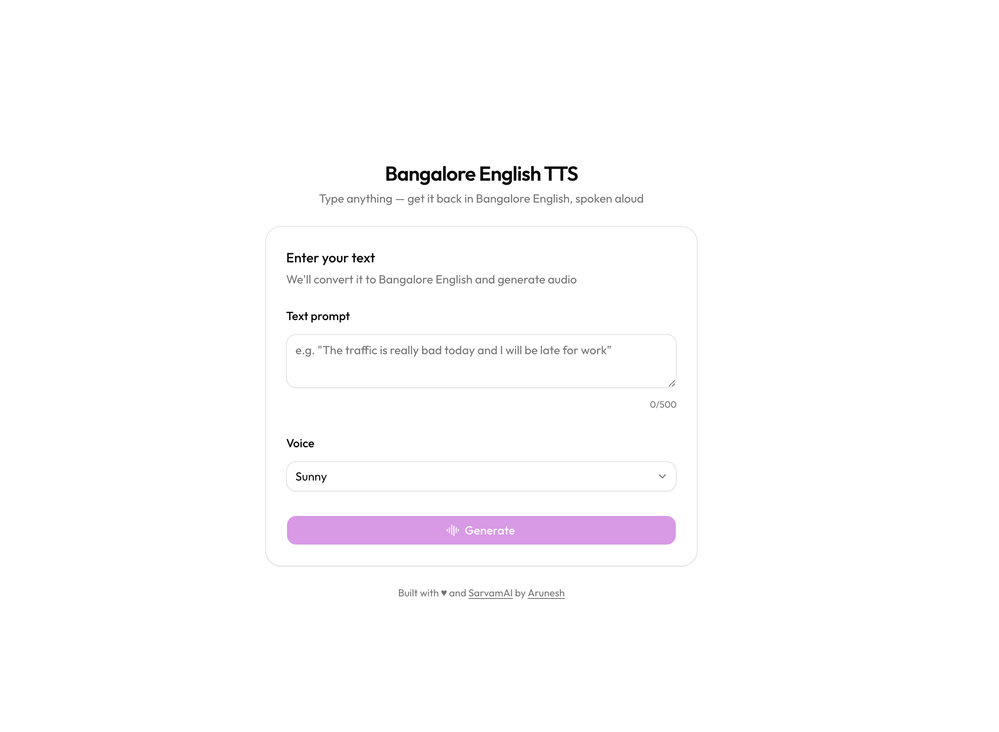

# Bangalore English TTS

Type anything — get it back in Bangalore English, spoken aloud.

## How it works

1. You enter any text
2. **Claude Haiku 4.5** rewrites it in authentic Bangalore English — complete with "macha", "put 1 scene", "gone scenes only", and all the classic mannerisms
3. **Sarvam AI Bulbul v3** converts that text to speech with natural Indian English voices
4. Play it in-browser, or download the audio

## Why?

This was a fun experiment to take part in the [challenge](https://x.com/SarvamAI/status/2020110829476307056?s=20) by Sarvam AI and have some fun ;) Also, thanks to @deburnotfunny on Instagram for being an inspiration (and examples for claude) with his reels.